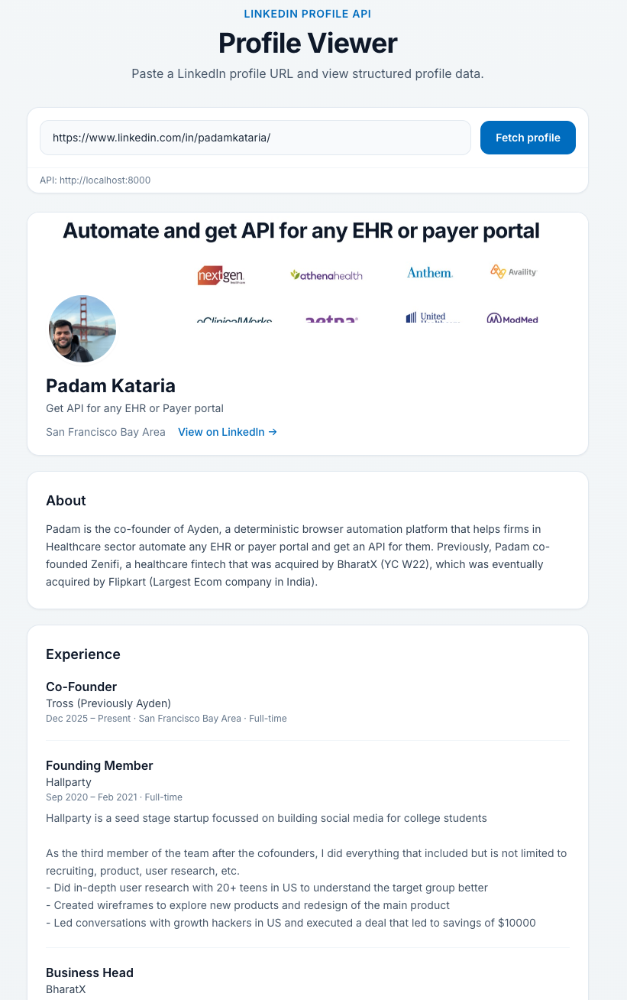

# LinkedIn Profile API

[](https://www.python.org/downloads/)
[](https://fastapi.tiangolo.com/)
[](./Dockerfile)
[](#quickstart)

**Zero headless browsers.** Structured profile JSON from LinkedIn’s internal Voyager REST API over HTTPS.

| | |
|---|---|
| **Live API Docs** | [https://linkedin-profile-api-bsa2.onrender.com/docs](https://linkedin-profile-api-bsa2.onrender.com/docs) |
| **Live Web Demo** | [https://linked-in-profile-api-livid.vercel.app/](https://linked-in-profile-api-livid.vercel.app/) |
| **Health** | [https://linkedin-profile-api-bsa2.onrender.com/health](https://linkedin-profile-api-bsa2.onrender.com/health) |

Warm-up (Render free tier may cold-start ~30–60s):

```bash
curl https://linkedin-profile-api-bsa2.onrender.com/health
# {"status":"ok"}
```

**Keep-alive:** a GitHub Actions cron (`.github/workflows/keep-render-alive.yml`) hits `/health` every **12 minutes** so the Render free instance stays warm for reviewers. Manual re-run is available via **Actions → Keep Render Alive → Run workflow**. Schedules can drift a few minutes under load.

<p align="center">
  
</p>

---

## Notice for Reviewers — Session Expiry & 60s Fallback

The hosted Render instance is pre-configured with `LI_AT` + `JSESSIONID`. LinkedIn sessions can invalidate at any time (expiry, IP shift, logout).

**If the live API returns `401 Unauthorized / 403 Forbidden`:**

1. Extract your own `li_at` and `JSESSIONID` (30s — see [Quickstart](#quickstart)).
2. Run locally:

```bash
cp .env.example .env   # fill LI_AT, JSESSIONID, USER_AGENT
pip install -r requirements.txt && uvicorn app.main:app --port 8000
```

3. Point the **deployed** Vercel UI at your local API:

```
https://linked-in-profile-api-livid.vercel.app/?api=http://localhost:8000
```

No redeploy. No code changes. Review continues immediately.

---

## Why Voyager REST

LinkedIn is migrating profile surfaces to **Server-Driven UI** (`/flagship-web/...` RSC Flight streams). Deep skills endpoints are dead (`/profileSkills` → 400, legacy `/skills` → 410). This service queries the consolidated Voyager decoration `FullProfileWithEntities-91` — one authenticated Rest.li call, full `included[]` entity graph, typically **&lt;300ms** — instead of parsing fragile UI trees.

Auth is the Rest.li 2.0 double-submit cookie pattern: `li_at` cookie + raw `JSESSIONID` as the `csrf-token` header. The parser groups `included[]` by `$type` and resolves vector artifacts into high-res CDN URLs.

| | Headless Browser | Direct Voyager REST |
|---|---|---|
| Approach | Playwright/Puppeteer render DOM | Authenticated `httpx` → Rest.li JSON |
| Latency | Seconds (browser cold start) | Sub-300ms typical |
| Fragility | CSS/DOM churn | `$type` entity schema (more stable) |
| Challenge fit | Disallowed | Required approach |
| Skills depth | Can paginate UI | First ~20 via Voyager; rest is SDUI-only |

---

## API Reference

| Method | Path | Body / Query |
|--------|------|--------------|
| `GET` | `/api/profile?url=` | LinkedIn URL or vanity slug |
| `POST` | `/api/profile` | `{"url": "https://www.linkedin.com/in/..."}` |

```bash
curl "https://linkedin-profile-api-bsa2.onrender.com/api/profile?url=https://www.linkedin.com/in/shreyan-bagchi/"
```

### Accepted input formats

| Input Format | Extracted Slug |
|:---|:---|
| `https://www.linkedin.com/in/shreyan-bagchi/` | `shreyan-bagchi` |
| `in.linkedin.com/in/shreyan-bagchi?trk=feed` | `shreyan-bagchi` |
| `linkedin.com/in/shreyan-bagchi` | `shreyan-bagchi` |
| `shreyan-bagchi` | `shreyan-bagchi` |

### Sample response (abridged from `response.json`)

```json
{
  "first_name": "Shreyan",
  "last_name": "Bagchi",
  "headline": "MTS@Oracle (OCI) || Backend Engineer || ...",
  "summary": "Software Engineer with experience at Oracle...",
  "public_identifier": "shreyan-bagchi",
  "profile_url": "https://www.linkedin.com/in/shreyan-bagchi/",
  "location": { "city": "Raurkela", "state": "Odisha", "country": "IN", "display": "Raurkela, Odisha, India" },
  "profile_picture_url": "https://media.licdn.com/dms/image/v2/.../profile-displayphoto-crop_800_800/...",
  "cover_picture_url": "https://media.licdn.com/dms/image/v2/.../profile-displaybackgroundimage-shrink_350_1400/...",
  "positions": [
    {
      "title": "Member of Technical Staff",
      "company_name": "Oracle",
      "location": "Bengaluru",
      "employment_type": "Full-time",
      "date_range": { "start_year": 2025, "start_month": 7, "is_current": false }
    }
  ],
  "educations": [
    {
      "school_name": "Indian Institute of Technology, Bhubaneswar",
      "degree_name": "Bachelor of Technology",
      "field_of_study": "Electrical and Electronics Engineering"
    }
  ],
  "skills": [{ "name": "Java" }, { "name": "Spring Boot" }, { "name": "PostgreSQL" }],
  "skills_total": 47,
  "treasury_media": [
    { "title": "strike07 - Codeforces", "url": "https://codeforces.com/profile/strike07", "kind": "url" }
  ],
  "fetched_at": "..."
}
```

Also returned when present: `certifications[]`, `languages[]`, `urn`.

### Errors

| HTTP | `error` | When |
|------|---------|------|
| 400 | `invalid_url` | Malformed / non-LinkedIn input |
| 401 | `unauthorized` | Session cookies expired or invalid |
| 403 | `forbidden` | LinkedIn denied access |
| 404 | `not_found` | Profile does not exist |
| 429 | `rate_limit_exceeded` | Upstream or API rate limit |
| 502 | `upstream_error` | LinkedIn 5xx / network failure |

Shape: `{"error": "...", "detail": "...", "status": N}`

---

## Quickstart

### Cookies (≈30s)

1. Log in at [linkedin.com](https://www.linkedin.com).
2. DevTools → **Application** → **Cookies** → `https://www.linkedin.com`.
3. Copy `li_at` and `JSESSIONID` (strip surrounding quotes from the latter when placing in `.env`).
4. Copy your browser `User-Agent` from any Network request header.

### Local (4 lines)

```bash
python -m venv .venv && source .venv/bin/activate
pip install -r requirements.txt
cp .env.example .env   # set LI_AT, JSESSIONID, USER_AGENT
uvicorn app.main:app --reload --port 8000
```

Swagger: [http://localhost:8000/docs](http://localhost:8000/docs)

### Docker

```bash
docker build -t linkedin-profile-api .
docker run -p 8000:8000 \
  -e LI_AT=... -e JSESSIONID=... -e USER_AGENT="Mozilla/5.0 ..." \
  linkedin-profile-api
```

### Tests

```bash
pytest -v
```

---

## Production Trade-offs & Limitations

### Auth model — what we rejected

We considered **per-request session cookies**: clients would send their own `X-Li-At` + `X-JSessionID` headers so the server holds no central account and never signs anyone out.

**We decided against it.** Routing a reviewer’s personal LinkedIn session through a third-party API is a ban risk — LinkedIn can flag the unusual IP / client fingerprint and lock or restrict that account. For a hiring challenge, that is an unacceptable ask of the reviewer.

**What we ship instead:** server-side env cookies only (`LI_AT` / `JSESSIONID`). Owner/private use; if the hosted session dies, reviewers spin up local with *their* cookies (see [Notice](#notice-for-reviewers--session-expiry--60s-fallback)) — credentials never leave their machine via the public demo.

### Other limits

- **Session cookie fragility** — `li_at` / `JSESSIONID` expire or invalidate on IP/logout; refresh env vars (or use the local fallback above). Never commit cookies.
- **Single-account rate limits + TTL cache** — one LinkedIn session backs all traffic; in-memory cache (`CACHE_TTL_SECONDS`, default 3600) and per-IP rate limiting (`RATE_LIMIT`, default `10/minute`) protect it.
- **Skills pagination boundary** — Voyager returns the first skills page (~20); `skills_total` reports the full count when available. Remaining skills live only under flagship-web SDUI; Voyager follow-up pagination is gone.
- **Schema / decoration drift** — `$type` names and `decorationId` can change; update `app/config.py` if responses empty out.
- **Visibility** — only profiles visible to the authenticated account are returned. Use responsibly w.r.t. LinkedIn ToS.

---

## Architecture (one glance)

```
Client → GET|POST /api/profile → URL normalizer → TTL cache
  → Voyager client (Rest.li 2.0 + retry) → parser (included[] by $type)
  → ProfileResponse
```

| Layer | Role |
|-------|------|
| `voyager_client` | Cookies + CSRF, `x-restli-protocol-version: 2.0.0`, retry on transient 5xx |
| `profile_parser` | Bucket `included[]` by `$type`, resolve photo/cover vector URNs → CDN |
| `profile_service` | Normalize → cache → fetch → parse |

**Voyager call:**

```
GET /voyager/api/identity/dash/profiles
  ?q=memberIdentity&memberIdentity={slug}
  &decorationId=com.linkedin.voyager.dash.deco.identity.profile.FullProfileWithEntities-91
```

MIT — credentials stay in env / host secrets only.
